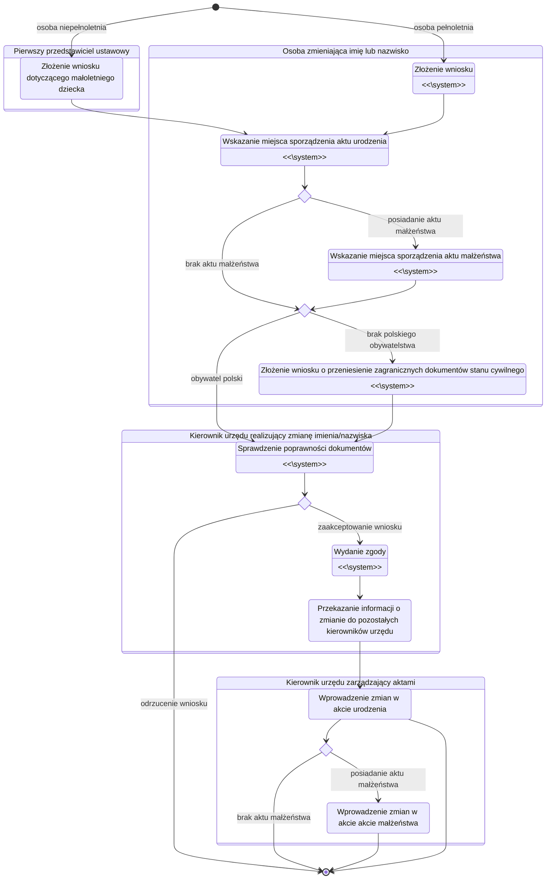
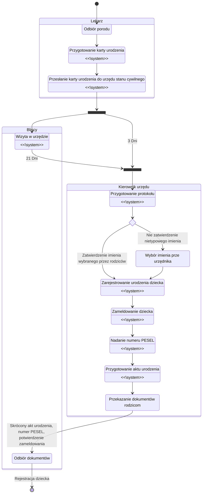
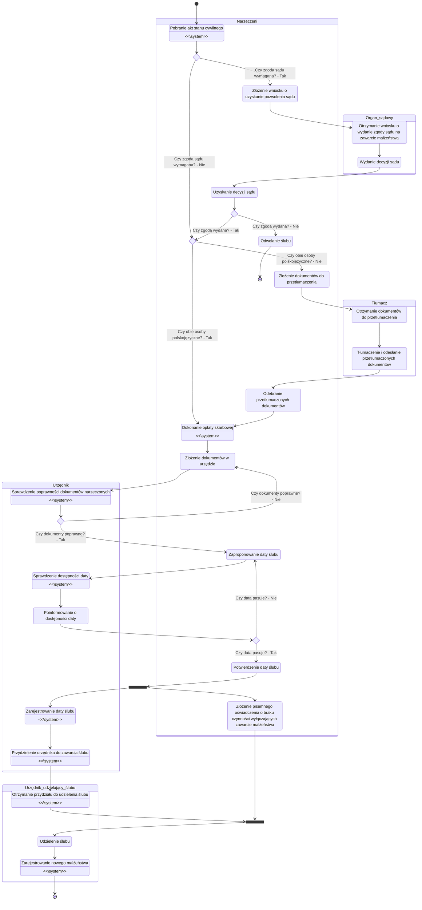
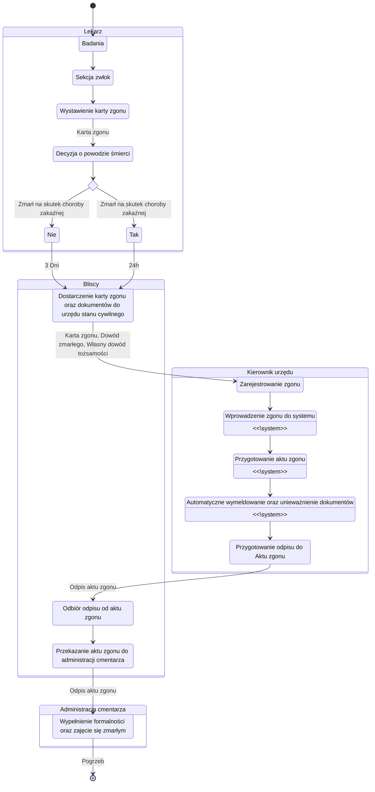
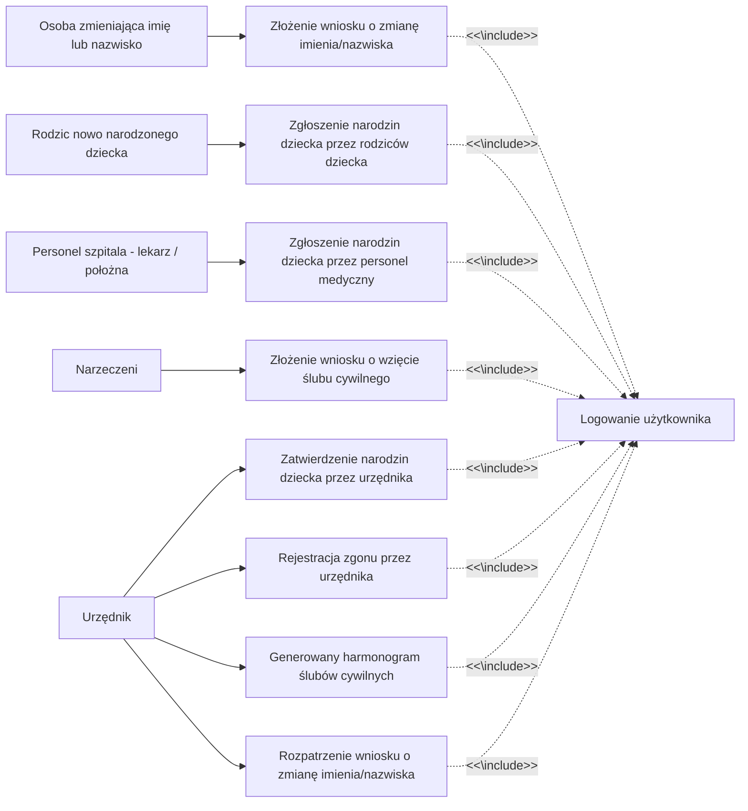
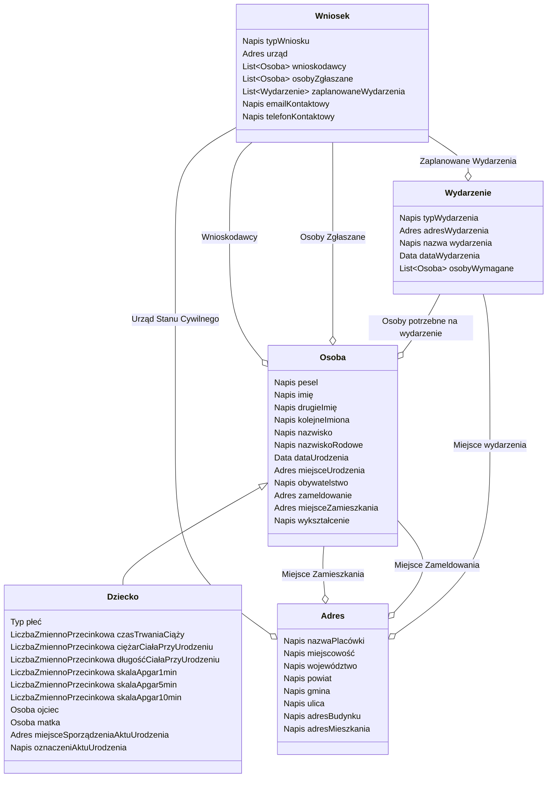

# Zarządzanie projektami informatycznymi

Przedmiot: **ZPI**

Semestr: **Zima 2022**

Temat: **System wspomagający działanie urzędu stanu cywilnego**

Zespół:
```
Brzozowski Mateusz
Krawczyk Bartłomiej
Topczewska Gabriela
```

## Założenia

Dokumentacja analityczna powstająca w ramach projektu informatycznego stanowi środek komunikacji i efekt porozumienia pomiędzy przyszłym użytkownikiem tego systemu a zespołem informatycznym: projektantami i programistami.

Dokumentacja powinna zostać przygotowana w taki sposób, aby:
1. Użytkownicy posiadający wiedzę specyficzną dla dziedziny zastosowań byli w stanie potwierdzić, że dokumentacja ta prawidłowo opisuje procesy, których realizację będzie wspomagał system informatyczny oraz właściwie określa funkcje tego systemu.
2. Projektanci i programiści byli w stanie, jedynie na podstawie tej dokumentacji, zaproponować zgodną z oczekiwaniami użytkownika implementację opisanych w dokumentacji analitycznej funkcji systemu.

# Modelowanie procesów biznesowych

## Cel

Rozdział dokumentu powinien opisywać kluczowe procesy biznesowe zachodzące w przedsiębiorstwie.

Przedsiębiorstwo lub organizacja pełnią rolę środowiska, w którym działał będzie projektowany system informatyczny.

Należy uwzględnić tylko te procesy, które na jakimś etapie (jedna lub więcej czynności w ramach procesu) będą wspierane przez system informatyczny. Można ograniczyć liczbę procesów do 3–5 (nietrywialnych).

## Wyniki prac

### Lista wykonawców czynności
lista wszystkich `wykonawców czynności` w ramach procesów biznesowych wraz z ich zwięzłym i precyzyjnym opisem.


### 1. Zmiana imienia/nazwiska
<!-- Mateusz Brzozowski -->
Wykonawcy czynności:
- osoba zmieniająca imię lub nazwisko
    - chce zmienić imię lub nazwisko
    - kto może:
        - pełnoletni obywatel polski
        - pełnoletni cudzoziemiec niemający obywatelstwa żadnego państwa, jeżeli ma w Polsce miejsce zamieszkania
        - pełnoletni cudzoziemiec, który uzyskał w Polsce status uchodźcy
        - osoba małoletnia, której rodzice zmienili nazwisko
        - osoba niepełnoletnia, która ukończyła 13 rok życia na wniosek jednego z rodzica
- rodzic
    - składa wniosek o zmianę nazwiska albo imienia osoby niepełnoletniej
    - wyraża zgodę na wniosek drugiego rodzica, jeżeli niepełnoletni ukończył 13 rok życia
- kierownik urzędu stanu cywilnego
    - odbiera wniosek o zmianę imienia lub nazwiska
    - akceptuje bądź odrzuca wniosek
    - przekazuje informacje do innych kierowników urzędów stanu cywilnego w celu nasienia zmiany do aktu urodzenia  i aktu małżeństwa
    - wprowadza zmiany w aktach stanu cywilnego osób

### 2. Narodziny
<!-- Bartłomiej Krawczyk -->

Wykonawcy czynności:
- rodzic / pełnomocnik
    - może to być:
        - matka lub ojciec dziecka, którzy mają ukończone 16 lat i nie zostali pozbawieni zdolności do czynności prawnych,
        - w pozostałych sytuacjach, na przykład jeśli matka dziecka ma mniej niż 16 lat lub została pozbawiona zdolności do czynności prawnych – dla przedstawiciela ustawowego (na przykład rodzica) lub opiekuna matki dziecka.
        - Urodzenie dziecka można zgłosić samodzielnie lub może zrobić to pełnomocnik.
    - należy przygotować:
        - dokument tożsamości
        - pełnomocnictwo (w przypadku skorzystania z pełnomocnika)
    - ma 21 dni na rejestrację dziecka w urzędzie
- osoba, która odebrała poród
    - lekarz lub położna
    - wystawia kartę urodzenia
    - ma 3 dni na przekazanie jej do urzędu stanu cywilnego
- kierownik urzędu stanu cywilnego
    - rejestruje urodzenie dziecka
    - przygotowuje protokół, który zawiera dane rodziców
    - rejestruje urodzenie dziecka, deklaruje zameldowanie oraz przydziela numer PESEL

### 3. Ślub cywilny
<!-- Gabriela Topczewska -->

Wykonawcy czynności:
- narzeczeni
    - osoby planujące zawarcie związku małżeńskiego
    - dokonują opłaty skarbowej
    - przygotowują wymagane dokumenty:
        - dokumenty tożsamości
        - jeśli jest potrzebne – zezwolenie sądu na zawarcie małżeństwa,
        - dowód opłaty skarbowej
        - zezwolenie sądu na zawarcie małżeństwa - jeśli wymagane
        - pełnomocnictwo - w przypadku korzystania z pełnomocnika
        - akta stanu cywilnego
    - udają się do urzędu dopełnić formalności na co najmniej miesiąc przed planowaną datą ślubu
    - ustalają datę ślubu
    - składają pisemne zapewnienie o nieistnieniu okoliczności wykluczających zawarcie małżeństwa
    - pobierają się
- urzędnik USC
    - sprawdza poprawność i prawdziwość danych na dokumentach zaręczonych
    - przygotowuje wymagane dokumenty i formularze do wypełnienia przez zaręczonych
    - sprawdza dostępność dat ślubu
    - rejestruje wybraną datę ślubu
- organ sądowy
    - udziela zgody sądu na zawarcie małżeństwa, kiedy prawdziwy jest którykolwiek z poniższych przypadków:
        - kobieta jest niepełnoletnia, ale ukończyła 16 lat,
        - osoby są ze sobą spowinowacone,
        - osoba jest dotknięta chorobą psychiczną albo niedorozwojem umysłowym
- tłumacz
    - w przypadku obcojęzyczności któregoś z przyszłych małżonków obowiązkowo udziela tłumacznia w urzędzie
    - w przypadku dokumentó osobistych obcojęzycznych
- urzędnik udzielający ślubu
    - udziela ślubu zaręczonym po wcześniejszym spełnieniu wszystkich wymogów formalnych przez małżonków

### 4. Zgon
<!-- Bartłomiej Krawczyk -->

Wykonawcy czynności:
- lekarz
    - lekarz może stwierdzić zgon na podstawie osobiście wykonanych badań i ustaleń, zaś w uzasadnionych przypadkach lekarz (z wyłączeniem lekarza dentysty) może uzależnić wystawienie karty zgonu od przeprowadzenia sekcji zwłok
    - wystawia kartę zgonu
- osoby związane ze zmarłą osobą
    - może to być:
        - współmałżonek osoby, która zmarła,
        - pozostała rodzina zmarłej osoby, na przykład dzieci, wnuki, prawnuki, rodzice, dziadkowie, brat, siostra, siostrzenica, bratanek, teściowie,
        - pełnomocnik jednej z powyższych osób.
    - zgłaszają śmierć osoby zmarłej do urzędu stanu cywilnego
    - we wniosku powinni zawrzeć:
        - kartę zgonu - od lekarza, który stwierdził zgon
        - dowód osobisty zmarłej osoby,
        - własny dokument tożsamości do okazania (potwierdzenie pełnomocnictwa)
- kierownik urzędu stanu cywilnego
    - rejestruje zgon - sporządzi akt zgonu - w dniu zgłoszenia
    - po rejestracji dostarcza bezpłatny odpis aktu zgonu
    - wnioski należy składać we właściwym urzędzie dla miejsca zgonu
    - po zgłoszeniu zgonu unieważniany jest dowód osobisty oraz następuje automatyczne wymeldowanie zmarłej osoby z miejsca pobytu stałego lub czasowego
- administracja cmentarza
    - na podstawie aktu zgonu decyduje o pochowaniu zmarłego

### Specyfikacje procesów biznesowych
zwięzły opis poszczególnych procesów biznesowych oraz specyfikacje czynności wykonywanych w ramach poszczególnych procesów zapisane jako diagramy aktywności (ang.activity diagram) w notacji UML. Na diagramach należy podać wykonawców czynności, korzystając z torów (ang. swimlanes) lub boksów. Ponadto, należy w szczególny sposób oznaczyć czynności (węzły diagramów), które wspierać będzie projektowany system informatyczny, np. opatrując je stereotypem **\<\<system\>\>**.

https://mermaid-js.github.io/mermaid/#/stateDiagram

### 1. Zmiana imienia/nazwiska
<!-- Mateusz Brzozowski -->



### 2. Narodziny
<!-- Bartłomiej Krawczyk -->



### 3. Ślub cywilny
<!-- Gabriela Topczewska -->



### 4. Zgon
<!-- Bartłomiej Krawczyk -->




# Modelowanie przypadków użycia

## Cel
Rozdział dokumentu powinien opisywać specyfikację interakcji (dialogu) użytkowników z projektowanym systemem informatycznym, umożliwiając zaprojektowanie jego interfejsu i sporządzenie makiety tego systemu.

## Wyniki prac

### Lista aktorów systemowych
lista użytkowników i systemów informatycznych `podejmujących interakcję` z projektowanym systemem.

<!-- Do opisania -->
Lista aktorów systemu informatycznego:
- osoba zmieniająca imię lub nazwisko
- rodzice nowo narodzonego dziecka
- personel szpitala - lekarze / położne
- narzeczeni
- urzędnicy

**TODO:** Ale urzędnicy są różni (będą korzystać z różnych funkcji systemu). Jest kierownik urzędu, urzędnik udzielający ślubu, etc. 

### Diagramy przypadków użycia systemu
sporządzone zgodnie z notacją UML diagramy ilustrujące przypadki użycia systemu i ich związki z odpowiednimi aktorami, oraz zależności pomiędzy przypadkami użycia (**\<\<include\>\>**,**\<\<extend\>\>**, generalizacja/specjalizacja).

Funkcje systemowe:
1. Logowanie użytkownika
2. Zgłoszenie narodzin dziecka przez personel medyczny
3. Zgłoszenie narodzin dziecka przez rodziców dziecka
4. Zatwierdzenie narodzin dziecka przez urzędnika
5. Rejestracja zgonu przez urzędnika
6. Złożenie wniosku o wzięcie ślubu cywilnego
7. Generowany harmonogram ślubów cywilnych
8. Złożenie wniosku o zmianę imienia/nazwiska
9. Rozpatrzenie wniosku o zmianę imienia/nazwiska.

**TODO:** To nie jest notacja diagramu use-case...
**TODO:** A co jeśli ktoś zgłosi się po wydanie jakiegoś dokumentu (np. odpisu)? Ten system nie umożliwia urzędnikowi wyszukiwania i przeglądania wniosków, aktów...




### Specyfikacje przypadków użycia systemu
specyfikacje przebiegu interakcji w obrębie poszczególnych przypadków użycia w postaci opisu scenariusza głównego (podstawowego), scenariuszy alternatywnych i punktów rozszerzeń.

**FU1**: Logowanie użytkownika

> Logowanie następuje poprzez urzędowy system - profil zaufany / bank / aplikacja mObywatel / eDowód

Scenariusz główny:
1. Użytkownik wybiera metodę logowania
2. System pokazuje formularz z wybraną metodą
3. Użytkownik wypełnia dane logowania
4. System przenosi zalogowanego użytkownika do strony głównej

Scenariusz alternatywny - użytkownik wybrał metodę uwierzytelnienia przez zewnętrzny system np. bank:
1. Użytkownik wybiera metodę logowania przez zewnętrzny system
2. System przekierowuje użytkownika do zewnętrznej strony
3. Użytkownik loguje się
4. Zewnętrzna strona przekierowuje ponownie do strony urzędu poprawnie zalogowanego użytkownika

Scenariusz alternatywny - błędne dane logowania:

1. takie jak w scenariuszu głównym
2. takie jak w scenariuszu głównym
3. Użytkownik podaje błędne dane logowania
4. System sygnalizuje błędnie wypełnione dane
5. Powrót do kroku 2.

**FU2**: Zgłoszenie narodzin dziecka przez personel medyczny

Scenariusz główny:
1. Logowanie użytkownika - FU1
2. System pokazuje formularz z kartą urodzenia do wypełnienia
3. Lekarz odbierający poród wypełnia formularz
4. Lekarz sprawdza poprawność formularza
5. System wysyła kartę urodzenia do urzędu

**FU3**: Zgłoszenie narodzin dziecka przez rodziców dziecka

Scenariusz główny:
1. Logowanie użytkownika - FU1
2. System prosi o zaznaczenie oświadczenia o byciu rodzicem
3. Użytkownik potwierdza wybór
4. System wyświetla formularze z informacjami do uzupełnienia o rodzicach dziecka
5. Użytkownik uzupełnienia informacje o ojcu dziecka
6. Użytkownik uzupełnienia informacje o matce dziecka
7. Użytkownik uzupełnienia informacje o dziecku
8. Wybiera adres zameldowania dziecka
9. System pyta o preferowany sposób kontaktu
10. Użytkownik uzupełnienia informacje o preferowanym kontakcie
11. System wyświetla podsumowanie wniosku
12. Użytkownik weryfikuje poprawność
13. Wysłanie wniosku do urzędu

Scenariusz alternatywny (rodzic nie pełnoletni)
1. Logowanie użytkownika - FU1
2. System wykrył, że użytkownik nie jest pełnoletni
3. System wyświetla informację o konieczności pójścia do urzędu z pełnomocnikiem 

Scenariusz alternatywny (użytkownik nie jest rodzicem)
1. Logowanie użytkownika - FU1
2. System prosi o zaznaczenie oświadczenia o byciu rodzicem
3. Użytkownik nie jest rodzicem
4. System informuje o konieczności pójścia do urzędu z pełnomocnikiem

**FU4**: Zatwierdzenie narodzin dziecka przez urzędnika

**TODO:** Którego dziecka? W nocy urodizła się setka dzieci. Brakuje funkcjonalności przeglądania zgłoszeń narodzin.

1. Logowanie użytkownika - FU1
2. Urzędnik przygotowuje protokół **TODO:** Jaki protokół i na podstawie czego?
3. System wyświetla otrzymane dane dziecka
4. Urzędnik weryfikuje poprawność danych oraz czy wybrane imię jest poprawne dla dziecka
5. Urzędnik zatwierdza formularz
6. Urzędnik wprowadza dane zameldowania dziecka
7. System generuje kolejny numer PESEL
8. Urzędnik zatwierdza formularz
9. System generuje akt urodzenia

Scenariusz alternatywny (urzędnik nie zatwierdza imienia dziecka)
- kroki 1-4 oraz 6-9 są takie same
5. Urzędnik wymyśla nowe imię oraz wprowadza je do systemu

**FU5**: Rejestracja zgonu przez urzędnika

1. Logowanie użytkownika - FU1
2. Urzędnik wprowadza zgon do systemu
3. System generuje akt zgonu
4. Urzędnik weryfikuje dane oraz zatwierdza formularz
5. System automatycznie wymeldowuje zmarłego oraz unieważnia dokumenty

**FU6**: Złożenie wniosku o wzięcie ślubu cywilnego

Scenariusz główny:
1. Logowanie użytkownika - FU1
2. Wybranie opcji złożenia wniosku o wzięcie ślubu cywilnego.
3. System wyświetla formularze dotyczące osób chcących zawrzeć związek małżeński.
4. Użytkownik wypełnia informacje o sobie oraz przyszłym współmałżonku.
5. Użytkownik wysyła prośbę o dołączenie aktów stanu cywilnego swojego oraz przyszłego współmałżonka do wniosku o zawarcie małżeństwa.
6. System dołącza akta do wniosku.
7. Weryfikacja poprawności danych przez użytkownika.
8. System pyta, czy użytkownik chce dokonać opłaty za wniosek teraz.
9. Użytkownik dokonuje opłaty.
10. System informuje użytkownika o kolejnych krokach, które ten musi podjąć po złożeniu wniosku.
11. Wniosek zostaje złożony w urzędzie.

Scenariusz alternatywny - przynajmniej 1 osoba jest obcokrajowcem:
1. Logowanie użytkownika - FU1
2. Wybranie opcji złożenia wniosku o wzięcie ślubu cywilnego.
3. System wyświetla formularze dotyczące osób chcących zawrzeć związek małżeński.
4. Użytkownik wypełnia informacje o sobie oraz przyszłym współmałżonku.
5. Użytkownik zaznacza, która z osób pochodzi spoza Polski.
6. System umożliwia dołączenie dokumentów z innego kraju.
7. System oznacza dokumenty jako obce.
8. Weryfikacja poprawności danych przez użytkownika.
9. System pyta, czy użytkownik chce dokonać opłaty za wniosek teraz.
10. Użytkownik dokonuje opłaty.
11. System informuje użytkownika o kolejnych krokach, które ten musi podjąć po złożeniu wniosku.
12. Wniosek zostaje złożony w urzędzie.

Scenariusz alternatywny - wymagana zgoda sądu na zawarcie małżeństwa:
1. Logowanie użytkownika - FU1
2. Wybranie opcji złożenia wniosku o wzięcie ślubu cywilnego.
3. System wyświetla formularze dotyczące osób chcących zawrzeć związek małżeński.
4. Użytkownik wypełnia informacje o sobie oraz przyszłym współmałżonku.
5. Użytkownik wysyła prośbę o dołączenie aktów stanu cywilnego swojego oraz przyszłego współmałżonka do wniosku o zawarcie małżeństwa.
6. System wykrywa, że potrzebna jest zgoda sądu na zawarcie małżeństwa.
7. System informuje o konieczności wybrania się do urzędu w celu wypełnienia niezbędnych formalności.

Scenariusz alternatywny - opłata dokonywana w urzędzie:
1. Logowanie użytkownika - FU1
2. Wybranie opcji złożenia wniosku o wzięcie ślubu cywilnego.
3. System wyświetla formularze dotyczące osób chcących zawrzeć związek małżeński.
4. Użytkownik wypełnia informacje o sobie oraz przyszłym współmałżonku.
5. Użytkownik wysyła prośbę o dołączenie aktów stanu cywilnego swojego oraz przyszłego współmałżonka do wniosku o zawarcie małżeństwa.
6. System dołącza akta do wniosku.
7. Weryfikacja poprawności danych przez użytkownika.
8. System pyta, czy użytkownik chce dokonać opłaty za wniosek teraz.
9. Użytkownik wybiera opcję zapłaty w urzędzie.
10. Wniosek jest oznaczany jako nieopłacony.
10. System informuje użytkownika o kolejnych krokach, które ten musi podjąć po złożeniu wniosku.
11. Wniosek zostaje złożony w urzędzie.

**FU7**: Generowany harmonogram ślubów cywilnych

Scenariusz główny:
1. Logowanie użytkownika - FU1
2. Użytkownik wybiera opcję generowania harmonogramu.
3. Użytkownik wybiera zakres dat, który go interesuje.
4. Użytkownik zatwierdza wybór.
5. System generuje harmonogram ślubów do pliku pdf.

Scenariusz alternatywny - użytkownik nie jest urzędnikiem:
1. Logowanie użytkownika - FU1
2. System wykrywa, że użytkownik nie jest urzędnikiem - brak możliwości wygenerowania harmonogramu.

**FU8**: Złożenie wniosku o zmianę imienia/nazwiska.

Scenariusz główny:
1. Logowanie użytkownika - FU1
2. Użytkownik wybiera opcję złożenia wniosku o zmianę imienia/nazwiska.
3. Wybó kogo dotyczy wniosek (użytkownika, czy małoletniego potomka).
4. Wypełnienie informacji nt. miejsca sporządzenia aktu urodzenia.
5. Jeśli dotyczy - wypełnienie informacji nt. miejsca sporządzenia aktu małżeństwa.
6. Jeśli dotyczy - złożenie wniosku o przeniesienie zagranicznych dokumentów stanu cywilnego.
7. Załączenie wymaganych dokumentów.
8. Wypełnienie informacji dot. motywacji do zmiany imienia/nazwiska.
9. Zatwierdzenie poprawności informacji przez użytkownika.
10. Wysłanie wniosku.

Scenariusz alternatywny - użytkownik niepełnoletni:
1. Logowanie użytkownika - FU1
2. Użytkownik wybiera opcję złożenia wniosku o zmianę imienia/nazwiska.
3. System rozpoznaje, że użytkownik jest niepełnoletni.
4. Wyświetlenie informacji o braku możliwości złożenia wniosku.

**FU9** Rozpatrzenie wniosku o zmianę imienia/nazwiska. 
1. Logowanie użytkownika - FU1
2. Otrzymanie informacji o nowym wniosku.
3. Sprawdzenie poprawności wniosku.
4. Zatwierdzenie wniosku.
5. Rozesłanie przez system informacji do wnioskodawców o pomyślnym zakończeniu rozpatrzenia wniosku.
6. Rozesłanie przez system informacji do innych urzędów o zmianie danych osobowych wnioskodawcy.
7. Uaktualnienie przez system akt stanu cywilnego wnioskodawcy.

### Projekty ekranów
graficzny szkic lub zrzut z ekranu komputera, ekranu/formularza służącego do wprowadzania danych lub wybierania opcji przez użytkownika w ramach danego przypadku użycia.


**Uwaga:** Dla każdego przypadku użycia na diagramie należy opracować jego specyfikację oraz projekt ekranu (jeśli z przypadkiem użycia wiąże się wprowadzanie danych, wybieranie opcji).

<div style="page-break-after: always;"></div>

**TODO:** Projekty ekranów muszą być jasno powiązane z przypadkami (który ekran, do którego przypadku)...

<!-- Mateusz Brzozowski -->
**Logowanie**


**Zgłoszenie narodzin dziecka przez personel medyczny**


**Zgłoszenie narodzin dziecka przez rodziców dziecka**


**Zatwierdzenie narodzin dziecka przez urzędnika**


# Modelowanie pojęć systemu

## Cel
Rozdział dokumentu powinien opisywać specyfikację pojęć związanych z projektowanym systemem.

## Wyniki prac

### Diagram klas
diagram klas przedstawiający pojęcia dotyczące projektowanego systemu informatycznego, sporządzony zgodnie z notacją UML. Specyfikacje klas (pojęć) powinny obejmować specyfikacje atrybutów, dla których należy wyspecyfikować odpowiedni typ niezwiązany jednak z określoną platformą implementacji, np. LiczbaCałkowita, LiczbaRzeczywista, Data, Napis itp. Należy wyspecyfikować związki pomiędzy klasami: związek asocjacji (i ew. jej szczególne przypadki - agregację i kompozycję) wraz z licznością końców, oraz związek generalizacji/specjalizacji.




### Specyfikacja klas
zwięzły opis znaczenia poszczególnych klas i ich atrybutów.

**Uwaga:** Nie podajemy operacji dla klas. Każda asocjacja musi być nazwana.
