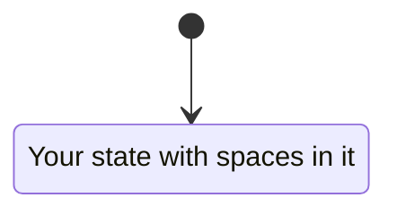
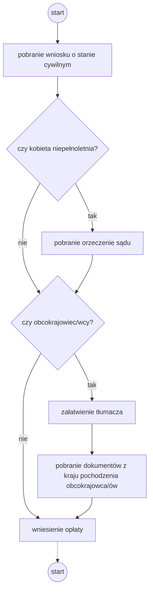

# Zarządzanie projektami informatycznymi

Przedmiot: **ZPI**

Semestr: **Zima 2022**

Temat: **System wspomagający działanie urzędu stanu cywilnego**

Zespół:
```
Brzozowski Mateusz
Krawczyk Bartłomiej
Topczewska Gabriela
```

## Czym się zajmuje?

- rejestracja: urodzeń, małżeństw, zgonów

- dokonywanie zmian w księgach na podstawie

- przyjmowanie oświadczeń o zawarciu związku małżeńskiego


- rejestracja

## Założenia

Dokumentacja analityczna powstająca w ramach projektu informatycznego stanowi środek komunikacji i efekt porozumienia pomiędzy przyszłym użytkownikiem tego systemu a zespołem informatycznym: projektantami i programistami.

Dokumentacja powinna zostać przygotowana w taki sposób, aby:
1. Użytkownicy posiadający wiedzę specyficzną dla dziedziny zastosowań byli w stanie potwierdzić, że dokumentacja ta prawidłowo opisuje procesy, których realizację będzie wspomagał system informatyczny oraz właściwie określa funkcje tego systemu.
2. Projektanci i programiści byli w stanie, jedynie na podstawie tej dokumentacji, zaproponować zgodną z oczekiwaniami użytkownika implementację opisanych w dokumentacji analitycznej funkcji systemu.

# Modelowanie procesów biznesowych

## Cel

Rozdział dokumentu powinien opisywać kluczowe procesy biznesowe zachodzące w przedsiębiorstwie.

Przedsiębiorstwo lub organizacja pełnią rolę środowiska, w którym działał będzie projektowany system informatyczny.

Należy uwzględnić tylko te procesy, które na jakimś etapie (jedna lub więcej czynności w ramach procesu) będą wspierane przez system informatyczny. Można ograniczyć liczbę procesów do 3–5 (nietrywialnych).

## Wyniki prac

### Lista wykonawców czynności
lista wszystkich `wykonawców czynności` w ramach procesów biznesowych wraz z ich zwięzłym i precyzyjnym opisem.


### 1. Zmiana imienia/nazwiska
<!-- Mateusz Brzozowski -->

### 2. Narodziny
<!-- Bartłomiej Krawczyk -->

### 3. Ślub cywilny
- przyszła panna młoda - jedna ze stron pragnąca zawrzeć związek małżeński
- przyszły pan młody - druga ze stron pragnąca zaawrzeć związek małżeński
- urzędnik USC - osoba prawna, mająca możliwość udzielenia ślubu cywilnego

### 4. Zgon
<!-- Bartłomiej Krawczyk -->

- 
- urzędnik
- para młoda

### Specyfikacje procesów biznesowych
zwięzły opis poszczególnych procesów biznesowych oraz specyfikacje czynności wykonywanych w ramach poszczególnych procesów zapisane jako diagramy aktywności (ang.activity diagram) w notacji UML. Na diagramach należy podać wykonawców czynności, korzystając z torów (ang. swimlanes) lub boksów. Ponadto, należy w szczególny sposób oznaczyć czynności (węzły diagramów), które wspierać będzie projektowany system informatyczny, np. opatrując je stereotypem **\<\<system\>\>**.

https://mermaid-js.github.io/mermaid/#/stateDiagram

### 1. Zmiana imienia/nazwiska
<!-- Mateusz Brzozowski -->



### 2. Narodziny
<!-- Bartłomiej Krawczyk -->

### 3. Ślub cywilny

Aby wziąć ślub cywilny wymagane jest dostarczenie odpowiedniej dokumentacji przez małżonków (dokumentacja ta może różnić się w zależności od wieku, czy pochodzenia przyszłych małżonków), złożenia podpisów i oświadczeń w urzędzie stanu cywilnego oraz wniesienie stosownej opłaty. Po dopełnieniu wymaganych formalności urzędnik może ustalić z parą młodą datę ślubu oraz przydzielić do tego wydarzenia urzędnika, który poprowadzi ceremonię. W ustalonym dniu para młoda może zawrzeć związek małżeński.



### 4. Zgon
<!-- Bartłomiej Krawczyk -->


# Modelowanie przypadków użycia

## Cel 
Rozdział dokumentu powinien opisywać specyfikację interakcji (dialogu) użytkowników z projektowanym systemem informatycznym, umożliwiając zaprojektowanie jego interfejsu i sporządzenie makiety tego systemu.

## Wyniki prac

### Lista aktorów systemowych 
lista użytkowników i systemów informatycznych `podejmujących interakcję` z projektowanym systemem.

### Diagramy przypadków użycia systemu
sporządzone zgodnie z notacją UML diagramy ilustrujące przypadki użycia systemu i ich związki z odpowiednimi aktorami, oraz zależności pomiędzy przypadkami użycia (**\<\<include\>\>**,**\<\<extend\>\>**, generalizacja/specjalizacja).

### Specyfikacje przypadków użycia systemu
specyfikacje przebiegu interakcji w obrębie poszczególnych przypadków użycia w postaci opisu scenariusza głównego (podstawowego), scenariuszy alternatywnych i punktów rozszerzeń.

### Projekty ekranów
graficzny szkic lub zrzut z ekranu komputera, ekranu/formularza służącego do wprowadzania danych lub wybierania opcji przez użytkownika w ramach danego przypadku użycia.

<!-- Mateusz Brzozowski -->

**Uwaga:** Dla każdego przypadku użycia na diagramie należy opracować jego specyfikację oraz projekt ekranu (jeśli z przypadkiem użycia wiąże się wprowadzanie danych, wybieranie opcji).

# Modelowanie pojęć systemu

## Cel
Rozdział dokumentu powinien opisywać specyfikację pojęć związanych z projektowanym systemem.

## Wyniki prac

### Diagram klas
diagram klas przedstawiający pojęcia dotyczące projektowanego systemu informatycznego, sporządzony zgodnie z notacją UML. Specyfikacje klas (pojęć) powinny obejmować specyfikacje atrybutów,dla których należy wyspecyfikować odpowiedni typ niezwiązany jednak z określoną platformą implementacji, np. LiczbaCałkowita, LiczbaRzeczywista, Data, Napis itp. Należy wyspecyfikować związki pomiędzy klasami: związek asocjacji (i ew. jej szczególne przypadki - agregację i kompozycję) wraz z licznością końców, oraz związek generalizacji/specjalizacji. 

### Specyfikacja klas
zwięzły opis znaczenia poszczególnych klas i ich atrybutów.

**Uwaga:** Nie podajemy operacji dla klas. Każda asocjacja musi być nazwana.
