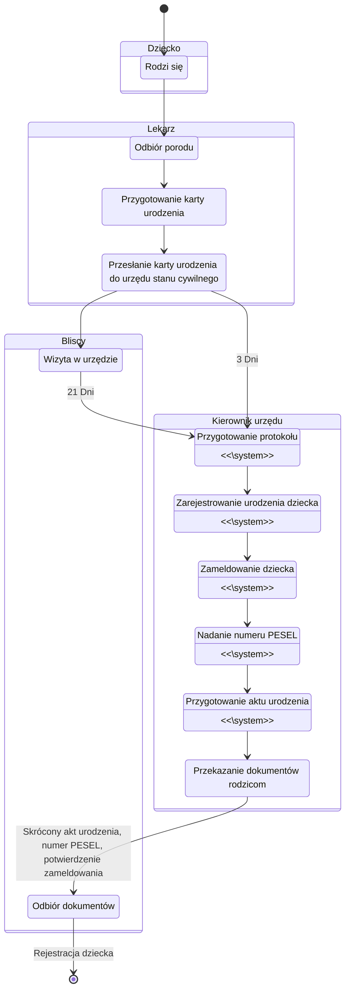

# Zarządzanie projektami informatycznymi

Przedmiot: **ZPI**

Semestr: **Zima 2022**

Temat: **System wspomagający działanie urzędu stanu cywilnego**

Zespół:
```
Brzozowski Mateusz
Krawczyk Bartłomiej
Topczewska Gabriela
```

## Czym się zajmuje?

- rejestracja: urodzeń, małżeństw, zgonów

- dokonywanie zmian w księgach na podstawie

- przyjmowanie oświadczeń o zawarciu związku małżeńskiego


- rejestracja

## Założenia

Dokumentacja analityczna powstająca w ramach projektu informatycznego stanowi środek komunikacji i efekt porozumienia pomiędzy przyszłym użytkownikiem tego systemu a zespołem informatycznym: projektantami i programistami.

Dokumentacja powinna zostać przygotowana w taki sposób, aby:
1. Użytkownicy posiadający wiedzę specyficzną dla dziedziny zastosowań byli w stanie potwierdzić, że dokumentacja ta prawidłowo opisuje procesy, których realizację będzie wspomagał system informatyczny oraz właściwie określa funkcje tego systemu.
2. Projektanci i programiści byli w stanie, jedynie na podstawie tej dokumentacji, zaproponować zgodną z oczekiwaniami użytkownika implementację opisanych w dokumentacji analitycznej funkcji systemu.

# Modelowanie procesów biznesowych

## Cel

Rozdział dokumentu powinien opisywać kluczowe procesy biznesowe zachodzące w przedsiębiorstwie.

Przedsiębiorstwo lub organizacja pełnią rolę środowiska, w którym działał będzie projektowany system informatyczny.

Należy uwzględnić tylko te procesy, które na jakimś etapie (jedna lub więcej czynności w ramach procesu) będą wspierane przez system informatyczny. Można ograniczyć liczbę procesów do 3–5 (nietrywialnych).

## Wyniki prac

### Lista wykonawców czynności
lista wszystkich `wykonawców czynności` w ramach procesów biznesowych wraz z ich zwięzłym i precyzyjnym opisem.


### 1. Zmiana imienia/nazwiska
<!-- Mateusz Brzozowski -->

### 2. Narodziny
<!-- Bartłomiej Krawczyk -->

Wykonawcy czynności:
- nowo narodzone dziecko
    - rodzi się
- rodzic / pełnomocnik
    - może to być:
        - matka lub ojciec dziecka, którzy mają ukończone 16 lat i nie zostali pozbawieni zdolności do czynności prawnych,
        - w pozostałych sytuacjach, na przykład jeśli matka dziecka ma mniej niż 16 lat lub została pozbawiona zdolności do czynności prawnych – dla przedstawiciela ustawowego (na przykład rodzica) lub opiekuna matki dziecka.
        - Urodzenie dziecka można zgłosić samodzielnie lub może zrobić to pełnomocnik. 
    - należy przygotować:
        - dokument tożsamości
        - pełnomocnictwo (w przypadku skorzystania z pełnomocnika)
    - ma 21 dni na rejestrację dziecka w urzędzie
- osoba, która odebrała poród
    - lekarz lub położna
    - wystawia kartę urodzenia
    - ma 3 dni na przekazanie jej do urzędu stanu cywilnego
- kierownik urzędu stanu cywilnego
    - rejestruje urodzenie dziecka
    - przygotowuje protokół, który zawiera dane rodziców
    - rejestruje urodzenie dziecka, deklaruje zameldowanie oraz przydziela numer PESEL

### 3. Ślub cywilny
<!-- Gabriela Topczewska -->

### 4. Zgon
<!-- Bartłomiej Krawczyk -->

Wykonawcy czynności:
- zmarły
    - umiera :o
- lekarz
    - lekarz może stwierdzić zgon na podstawie osobiście wykonanych badań i ustaleń, zaś w uzasadnionych przypadkach lekarz (z wyłączeniem lekarza dentysty) może uzależnić wystawienie karty zgonu od przeprowadzenia sekcji zwłok
    - wystawia kartę zgonu
- osoby związane ze zmarłą osobą
    - może to być:
        - współmałżonek osoby, która zmarła,
        - pozostała rodzina zmarłej osoby, na przykład dzieci, wnuki, prawnuki, rodzice, dziadkowie, brat, siostra, siostrzenica, bratanek, teściowie,
        - pełnomocnik jednej z powyższych osób.
    - zgłaszają śmierć osoby zmarłej do urzędu stanu cywilnego
    - we wniosku powinni zawrzeć:
        - kartę zgonu - od lekarza, który stwierdził zgon
        - dowód osobisty zmarłej osoby,
        - własny dokument tożsamości do okazania (potwierdzenie pełnomocnictwa)
- kierownik urzędu stanu cywilnego
    - rejestruje zgon - sporządzi akt zgonu - w dniu zgłoszenia
    - po rejestracji dostarcza bezpłatny odpis aktu zgonu
    - wnioski należy składać we właściwym urzędzie dla miejsca zgonu
    - po zgłoszeniu zgonu unieważniany jest dowód osobisty oraz następuje automatyczne wymeldowanie zmarłej osoby z miejsca pobytu stałego lub czasowego
- administracja cmentarza
    - na podstawie aktu zgonu decyduje o pochowaniu zmarłego

### Specyfikacje procesów biznesowych
zwięzły opis poszczególnych procesów biznesowych oraz specyfikacje czynności wykonywanych w ramach poszczególnych procesów zapisane jako diagramy aktywności (ang.activity diagram) w notacji UML. Na diagramach należy podać wykonawców czynności, korzystając z torów (ang. swimlanes) lub boksów. Ponadto, należy w szczególny sposób oznaczyć czynności (węzły diagramów), które wspierać będzie projektowany system informatyczny, np. opatrując je stereotypem **\<\<system\>\>**.

https://mermaid-js.github.io/mermaid/#/stateDiagram

### 1. Zmiana imienia/nazwiska
<!-- Mateusz Brzozowski -->

### 2. Narodziny
<!-- Bartłomiej Krawczyk -->



### 3. Ślub cywilny
<!-- Gabriela Topczewska -->

### 4. Zgon
<!-- Bartłomiej Krawczyk -->


# Modelowanie przypadków użycia

## Cel 
Rozdział dokumentu powinien opisywać specyfikację interakcji (dialogu) użytkowników z projektowanym systemem informatycznym, umożliwiając zaprojektowanie jego interfejsu i sporządzenie makiety tego systemu.

## Wyniki prac

### Lista aktorów systemowych 
lista użytkowników i systemów informatycznych `podejmujących interakcję` z projektowanym systemem.

### Diagramy przypadków użycia systemu
sporządzone zgodnie z notacją UML diagramy ilustrujące przypadki użycia systemu i ich związki z odpowiednimi aktorami, oraz zależności pomiędzy przypadkami użycia (**\<\<include\>\>**,**\<\<extend\>\>**, generalizacja/specjalizacja).

### Specyfikacje przypadków użycia systemu
specyfikacje przebiegu interakcji w obrębie poszczególnych przypadków użycia w postaci opisu scenariusza głównego (podstawowego), scenariuszy alternatywnych i punktów rozszerzeń.

### Projekty ekranów
graficzny szkic lub zrzut z ekranu komputera, ekranu/formularza służącego do wprowadzania danych lub wybierania opcji przez użytkownika w ramach danego przypadku użycia.

<!-- Mateusz Brzozowski -->

**Uwaga:** Dla każdego przypadku użycia na diagramie należy opracować jego specyfikację oraz projekt ekranu (jeśli z przypadkiem użycia wiąże się wprowadzanie danych, wybieranie opcji).

# Modelowanie pojęć systemu

## Cel
Rozdział dokumentu powinien opisywać specyfikację pojęć związanych z projektowanym systemem.

## Wyniki prac

### Diagram klas
diagram klas przedstawiający pojęcia dotyczące projektowanego systemu informatycznego, sporządzony zgodnie z notacją UML. Specyfikacje klas (pojęć) powinny obejmować specyfikacje atrybutów,dla których należy wyspecyfikować odpowiedni typ niezwiązany jednak z określoną platformą implementacji, np. LiczbaCałkowita, LiczbaRzeczywista, Data, Napis itp. Należy wyspecyfikować związki pomiędzy klasami: związek asocjacji (i ew. jej szczególne przypadki - agregację i kompozycję) wraz z licznością końców, oraz związek generalizacji/specjalizacji. 

### Specyfikacja klas
zwięzły opis znaczenia poszczególnych klas i ich atrybutów.

**Uwaga:** Nie podajemy operacji dla klas. Każda asocjacja musi być nazwana.
